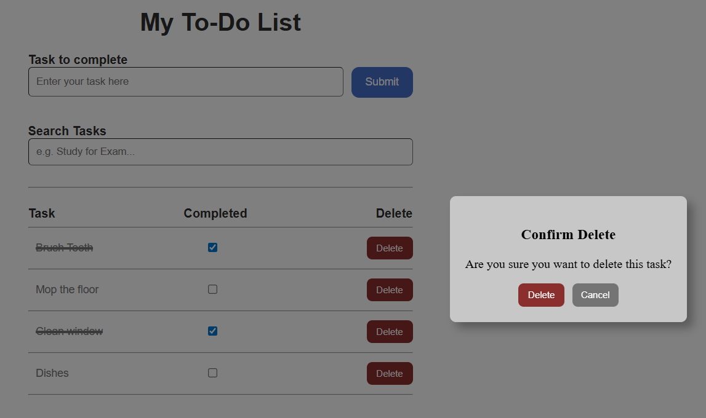

# Todo List Application

A modern, responsive todo list application built with Angular 20.1.3 that helps you organize and manage your daily tasks efficiently.

## Screenshots

<!-- Add your application screenshots here -->

*Main application interface with todo items*


*Delete confirmation dialog*


*Search functionality in action*

## Features

- ✅ Add new todo items
- ✏️ Edit existing todos
- ❌ Delete completed tasks
- 🔄 Mark tasks as complete/incomplete
- 💾 Data persistence
- 📱 Responsive design for mobile and desktop

## Live Demo

<!-- Add your live demo link here -->
[View Live Demo](your-demo-url-here)

## Project Structure

```
src/
├── app/
│   ├── todo-item/          # Todo item component
│   ├── todo-list/          # Todo list component  
│   ├── todo-service.ts     # Todo service for data management
│   ├── app.ts              # Main app component
│   └── app.routes.ts       # Application routing
├── styles.css              # Global styles
├── index.html              # Main HTML file
└── main.ts                 # Application entry point
```

## Technologies Used

- **Angular 20.1.3** - Frontend framework
- **TypeScript** - Programming language
- **CSS3** - Styling
- **HTML5** - Markup

## Installation

1. Clone the repository:
```bash
git clone https://github.com/waleedrimawi1/To-Do-List.git
cd todo-list
```

2. Install dependencies:
```bash
npm install
```

3. Start the development server:
```bash
ng serve
```

## Usage

1. **Adding Todos**: Click the add button or input field to create new tasks
2. **Editing Todos**: Click on any todo item to edit its content
3. **Completing Todos**: Check the checkbox to mark tasks as complete
4. **Deleting Todos**: Use the delete button to remove completed or unwanted tasks

## Contributing

1. Fork the repository
2. Create your feature branch (`git checkout -b feature/AmazingFeature`)
3. Commit your changes (`git commit -m 'Add some AmazingFeature'`)
4. Push to the branch (`git push origin feature/AmazingFeature`)
5. Open a Pull Request

## License

This project is licensed under the MIT License - see the [LICENSE](LICENSE) file for details.

## Contact

Waleed Rimawi - [@waleedrimawi1](https://github.com/waleedrimawi1)

Project Link: [https://github.com/waleedrimawi1/To-Do-List](https://github.com/waleedrimawi1/To-Do-List)
